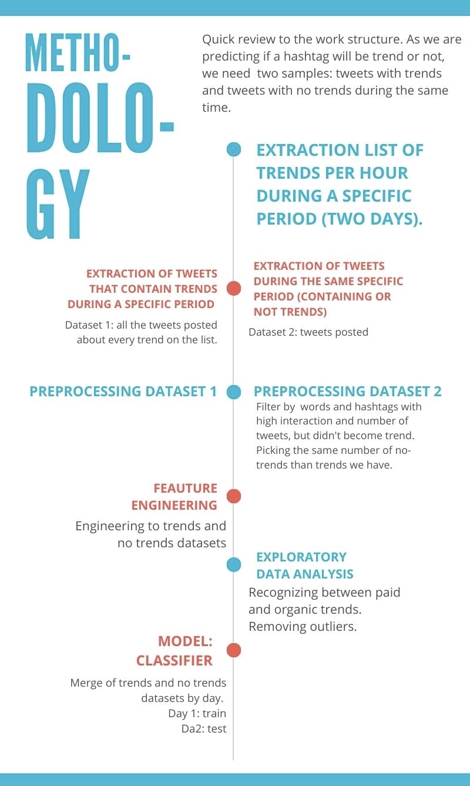

# Twitter-Trends-Prediction
This project pretends to design an algorithm to attain which words or hashtags in Twitter will become trend, througout the analysis of the interaction and engagement between users, the number of tweets and the change of velocity and acceleration over a specific period.

As an initial project, the dataset comprises two random days in Twitter Spain, but the present work is still under developing and open to be improved during a longer time interval or taking care of other aspects, such as the profile of the users. For that reason, we invite you to collaborate.

# Data
Due to Github size limit, we can't upload all the data to run the algorithm, just the txt docs. Instead, you can find all the datasets (csv) on (https://www.kaggle.com/pilarlc/datasets).

# Authors
Pilar Lorente [LinkedIn](https://www.linkedin.com/in/pilarlc/)

Carlos Ruiz

Ismael Madalena

Daniel W. Tümmler
